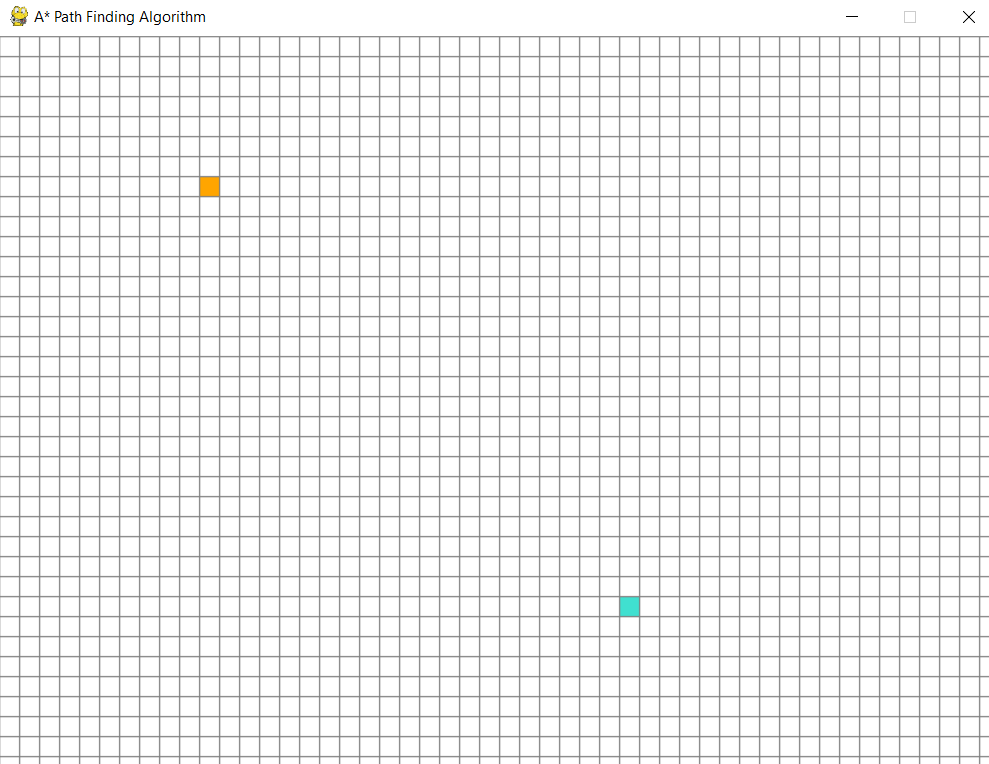

# A-star-Path-Finder-Visualization
This project demonstrates my implementation of the A* algorithm in Python, which is widely used for efficient pathfinding in grid-based environments. With the help of pygame graphics, I have created a visually interactive application that allows users to define a start and end point and visually observe the algorithm finding the shortest path.

The A* algorithm is a widely used pathfinding algorithm that finds the shortest path between two points on a graph. It is especially useful in grid-based environments, such as maps or mazes.

1. Initially, the grid is displayed in its default state when the script is executed.

2. The user can interactively select a starting and ending point on the grid using their mouse.
   
3. Upon initiating the pathfinding process by pressing the space bar, the script visually demonstrates the step-by-step pathfinding from the chosen start point to the end point.
   
4. Additionally, the user has the ability to obstruct the path by placing obstacles on the grid using their mouse.
   
5. To reset the grid and remove all markings, the user can simply press the 'c' key on their keyboard.
